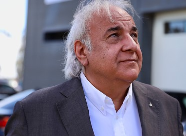

#   
**Name:** José Carlos 
**Age:** 65  
**Occupation:** Mechanic - Owner
**Location:** Lisbon, Portugal  

## Background  
José Carlos is a mechanic with over 40 years of experience in the automotive industry. He started in a small garage and eventually opened his own in Lisbon. With a passion for cars and a great reputation, José has built a loyal customer base over the years. He is a family man, married with two children who loves what he does

## Daily Life  
José starts his day early, arriving at the workshop by 7:30 AM. He spends his mornings managing appointments, overseeing repairs, and communicating with clients. In the afternoon, he focuses on administrative tasks, such as updating service records. José uses his computer to manage bookings and his smartphone to communicate with clients. His evenings are reserved for family time, though he often finds himself thinking about ways to improve his business

## Goals & Needs  
José aims to upgrade his workshop operations to provide faster and more efficient service to his clients. He wants to maintain detailed records of all services performed on each vehicle to ensure quality and build trust with his customers. Additionally, he seeks to enhance client communication and loyalty by offering personalized services and timely reminders for maintenance

## Pain Points & Challenges  
José struggles with managing multiple tasks simultaneously, such as handling appointments, updating service records, and communicating with clients. The lack of an integrated system often leads to errors. He also finds it challenging to keep track of client preferences and vehicle histories, which affects his ability to offer personalized services

## Motivation  
José is motivated by his desire to provide the best possible service to his clients while running an efficient and profitable business. He believes that by adopting a comprehensive management tool, he can improve his workshop's operations and enhance client satisfaction
