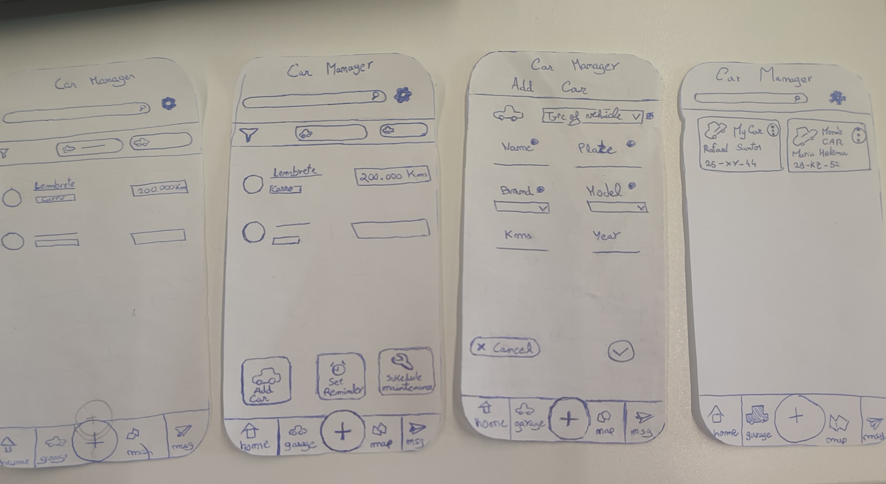
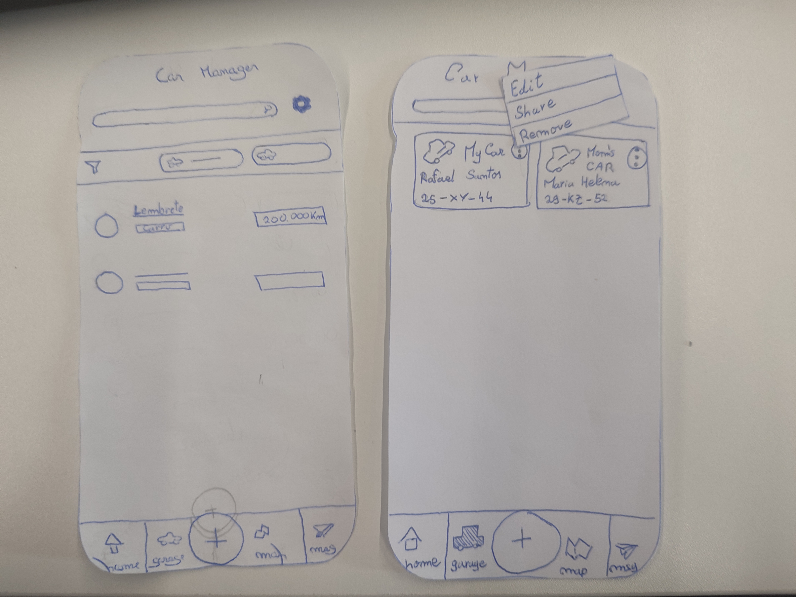
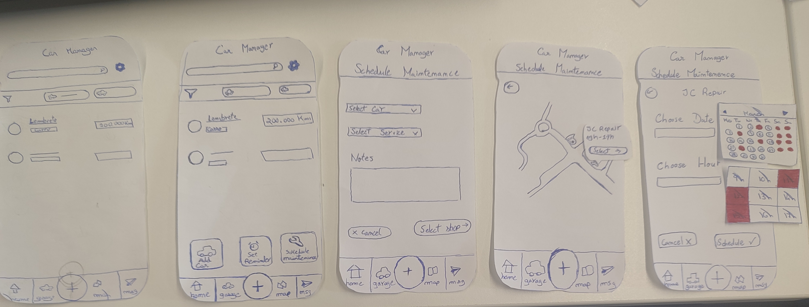
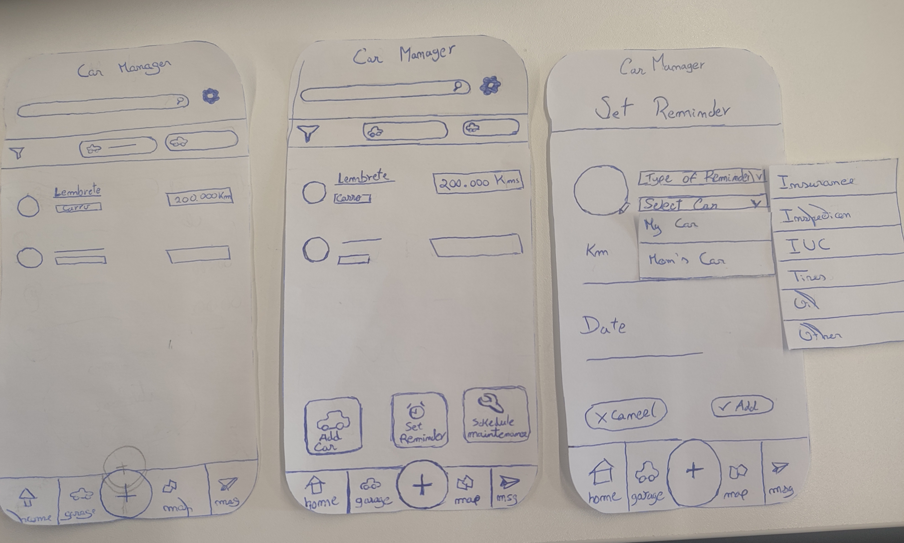

[Back to main Logbook Page](../hci_logbook.md)

---
# Low Fidelity Prototype and Evaluation

## D.1. Low Fidelity Prototype

### Add Car

### Share Car

### Schedule Maintenance

### Set Reminder 

## D.2. Prototype Evaluation

#### Participant 1:

##### Task Performance:
Successfully completed all steps except for adding an authorized user to a vehicle (accidentally navigated to the messages menu instead)

##### Key Suggestion:
Proposed that scheduling maintenance should automatically open the messaging interface to facilitate communication with mechanic

#### Participant 2:

##### Task Performance:
Successfully completed all steps

##### Key Suggestion:
Recommended changing the location of the generic “+” button so that it is more “visible”, since it is the most important element in our application

#### Participant 3:

##### Task Performance:
Struggled to locate the "Add Reminder" functionality

##### Key Suggestion:
He didn't say much, just said that the struggle might have been his fault. We then suggested the relocation of the button to make it more visible, and he agreed that it could be a good idea

---
[Back to main Logbook Page](../hci_logbook.md)

---