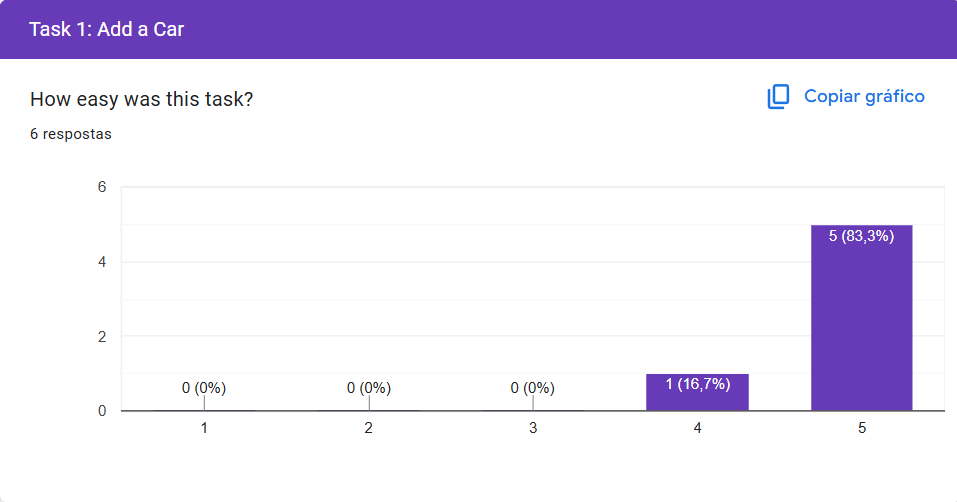

[Back to main Logbook Page](../hci_logbook.md)

---

# E. Functional Prototype and Evaluation

# Prototype

## Task 1: Add Car

## Task 2: Share Car

## Task 3: Schedule Maintenance

## Task 4: Set Reminder

# E.X. User Evaluation

## Personal information

## Review 1: Add Car

## Review 2: Share Car

## Review 3: Schedule Maintenance

## Review 4: Set Reminder

## SUS Score:

#### Final Score: 89.70

---
[Back to main Logbook Page](../hci_logbook.md)

---