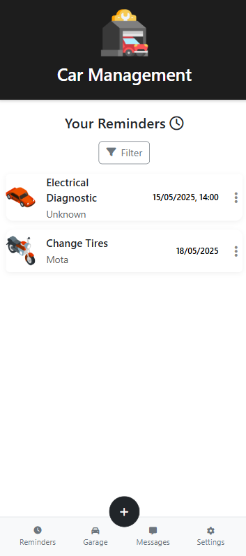
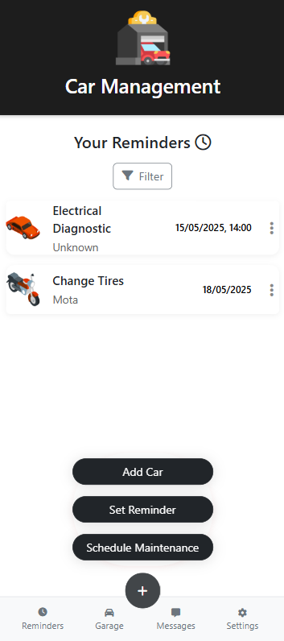
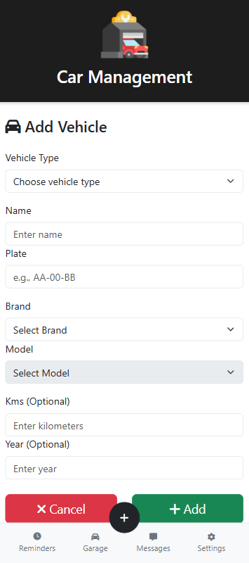
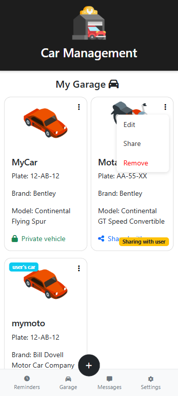
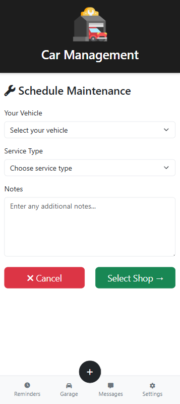
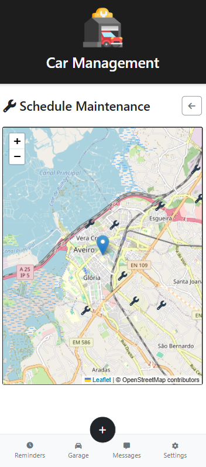
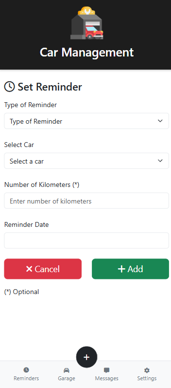
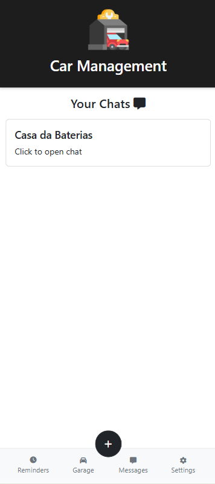
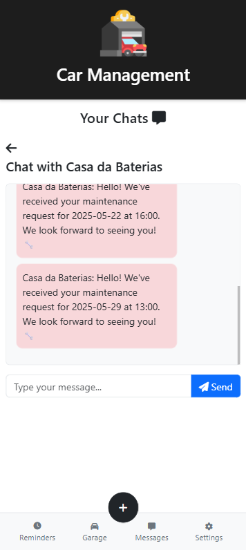
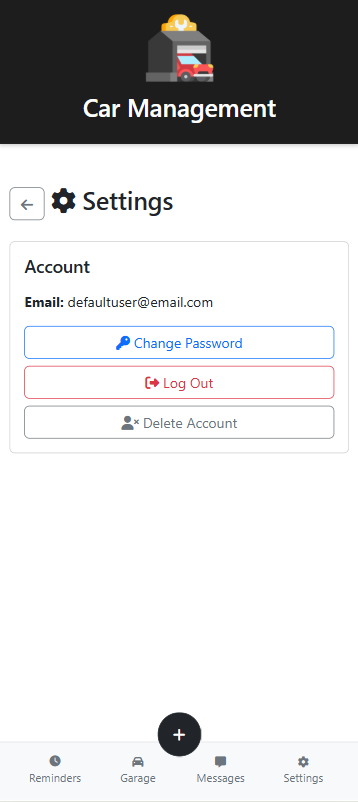

[Back to main Logbook Page](../hci_logbook.md)

---

# F. Discussion of Evaluation Results

# Refinement List
With the feedback from the user evaluation, we have identified some areas for improvement in our prototype:
- Improve interface
- Forget the “workshops” page, it was our worst rating and was confusing users

# Refined Prototype

## Task 1: Add Car

## Task 2: Share Car

## Task 3: Schedule Maintenance

## Task 4: Set Reminder

## Extras:

### Messages:

### Settings:

---
[Back to main Logbook Page](../hci_logbook.md)

---